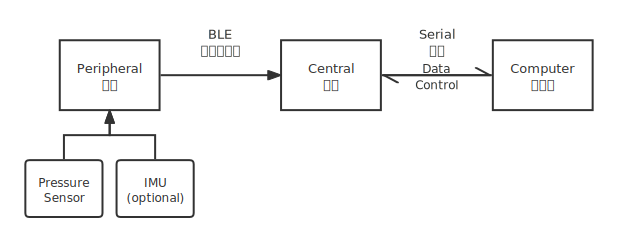

# PressureSense

本项目面向阵列压力传感（或其他阵列信号传感应用），包括如下环节：

- 信号采集：硬件采集信号，通过串口与计算机通信，有两种选择
  - 双nRF52832采集：从机采集传感器信号，通过蓝牙BLE无线传输至主机，主机通过串口有线传输至计算机，代码在本仓库
  - 单Arduino采集：采集传感器信号后直接通过串口有线传输至计算机，代码见[MatKit](https://github.com/atomiechen/MatKit)仓库
- 信号处理与上层应用：计算机端程序处理串口接收数据并开发上层应用，代码见[MatKit](https://github.com/atomiechen/MatKit)仓库

本仓库代码采用的架构如下图所示：




## 开发环境

开发芯片：nRF52832，开发板：PCA10040

- 基于官方SDK：nRF5 SDK 15.2.0
- IDE：Keil uvision5
- 需要安装pack：NordicSemiconductor.nRF_DeviceFamilyPack.8.17.0，见`prerequisites`文件夹

阵列传感器：支持最多16\*16阵列采集，需要配合ADG725多路选择器

IMU（可选）：MPU6050


## 项目与文件路径

共有四个nRF52832工程项目与一个Python控制脚本：

- 主机项目：连接从机蓝牙，与计算机串口通信传送数据

- 从机含IMU数据的DFU项目：采集阵列传感器数据和IMU数据，通过蓝牙发送至主机，可OTA DFU空中升级

- 从机DFU项目：采集阵列传感器数据，通过蓝牙发送至主机，可OTA DFU空中升级

- 从机无DFU项目：采集阵列传感器数据，通过蓝牙发送至主机，不支持DFU

- 计算机端Python主机串口控制脚本`select_cli.py`：控制主机如何选择连接从机，需要配置`pyserial`包

  ```sh
  pip3 install pyserial
  ```


其中，各个工程项目共享总SDK文件夹，不同项目的区别入口在`nRF5_SDK_15.2.0_9412b96\examples`

- 主机项目：`nRF5_SDK_15.2.0_9412b96\examples\ble_central\serial_uart\`
  - 工程文件：`nRF5_SDK_15.2.0_9412b96\examples\ble_central\serial_uart\pca10040\s132\arm5_no_packs`
- 从机含IMU数据的DFU项目：`nRF5_SDK_15.2.0_9412b96\examples\ble_peripheral\ADG725_DFU_IMU\`
  - 工程文件：`nRF5_SDK_15.2.0_9412b96\examples\ble_peripheral\ADG725_DFU_IMU\pca10040\s132\arm5_no_packs`
  - DFU相关文件：`DFU_key`
- 从机DFU项目：`nRF5_SDK_15.2.0_9412b96\examples\ble_peripheral\ADG725_DFU\`
  - 工程文件：`nRF5_SDK_15.2.0_9412b96\examples\ble_peripheral\ADG725_DFU\pca10040\s132\arm5_no_packs`
  - DFU相关文件：`DFU_key`
- 从机无DFU项目：`nRF5_SDK_15.2.0_9412b96\examples\ble_peripheral\ADG725\`
  - 工程文件：`nRF5_SDK_15.2.0_9412b96\examples\ble_peripheral\ADG725\pca10040\s132\arm5_no_packs`


## 从机说明

### 可配置项

从机`main.c`中可以使用如下宏来定义传感器规格`sch`：

```c
// 16*16方形，顺序扫描
SCH_16_16_SQUARE(sch);

// 16*16梯形，非常规扫描，具体遍历方式见matrix_sensor.c
SCH_16_16_TRAPEZOID(sch);

// 4*4方形，顺序扫描
SCH_4_4_SQUARE(sch);

// 8*8梯形，非常规扫描，具体遍历方式见matrix_sensor.c
SCH_8_8_TRAPEZOID(sch);
```

宏定义及相应遍历函数定义在`nRF5_SDK_15.2.0_9412b96\components\libraries\matrix_sensor`下的`matrix_sensor.h`与`matrix_sensor.c`中供参考，也可根据需要自行定制。


### DFU文件生成

从机DFU生成key的文件夹：

- 含IMU数据从机项目：`DFU_key_IMU`
- 不含IMU数据从机项目：`DFU_key`

在对应项目生成DFU key的文件夹下，执行`make`命令可生成：

- `ADG725_output.zip`：手机DFU传送包
- `app_setting.hex`：自动运行application而非停在bootloader模式的设置文件
- `merged.hex`：将协议栈、bootloader、application和设置文件合并的HEX文件，可一步烧写到位，不必多次烧写

也可参考文件夹中的`DFU路径及指令.txt`（相关内容如下）手动执行相应命令：

```sh
# Generate keys:
nrfutil keys generate private.key
nrfutil keys display --key pk --format code private.key --out_file dfu_public_key.c

# Generate zip file:
nrfutil pkg generate --hw-version 52 --application-version 1 --application nrf52832_xxaa.hex --sd-req 0xaf --key-file private.key ADG725_output.zip

# Generate setting file:
nrfutil settings generate --family NRF52 --application-version 1 --application nrf52832_xxaa.hex --bootloader-version 1 --bl-settings-version 1 app_setting.hex

# Merge multiple HEX files:
mergehex --merge s132_nrf52_6.1.0_softdevice.hex boot.hex nrf52832_xxaa.hex --output tmp3to1.hex
mergehex --merge tmp3to1.hex app_setting.hex --output merged.hex
```


## 主机说明

### 可配置项

主机`main.c`中有如下可配置项：

```c
// 名称过滤：配置是否让主机按照名称搜索从机，默认关闭
bool name_filter = false;  // enable name filter or not

// 如果打开名称过滤，则此项配置想要连接的从机名称，默认为PresenabX
static char const *m_target_periph_name = "PresenabX";             /**< Name of the device we try to connect to. This name is searched for in the scan report data*/

// 配置主机向计算机串口发送数据的通信协议，0为simple协议，1为secure协议，默认为secure协议
int protocol = 1;  // 0 for simple, 1 for secure
```

主机向计算机串口发送数据的通信协议有两种：

- secure：默认，数据帧有头有尾，会考虑转义字符，比较安全，需要传输IMU数据时必须使用此协议
- simple：数据帧用0xFF来分割，比较简单

要保证主机发送端和计算机接收端设置成一样的通信协议。


### 主机串口控制

主机默认按照UUID搜索从机，也可以在主机上位机即计算机的控制下附加名称过滤。计算机通过串口向主机发送控制命令。

串口控制通信API：

| 编码                      | 命令                      | 含义                                                         | 返回   |
| ------------------------- | ------------------------- | ------------------------------------------------------------ | ------ |
| 0(byte)                   | reconnect                 | 按当前配置重新连接                                           | 无     |
| 1(byte)                   | name                      | 获取在名称过滤开启时所搜索的从机名                           | 字符串 |
| 2(byte)+str               | connect name              | 发送搜索从机名并重新搜索连接到该从机（自动打开名称过滤）     | 无     |
| 3(byte)+cmd(byte)         | namefilter enable/disable | 开启/关闭名称过滤并重新连接，0表示关闭，1表示开启，如果已开启/关闭则无变化 | 无     |
| 4(byte)+protocol_id(byte) | protocol protocol_id      | 切换通信协议，0表示simple，1表示secure                       | 无     |

双方通信通过以下协议打包分帧：

- 头字节：0xEB
- 帧内容，需要转义的情况如下：
  - 原字节为0xEC，转义为0xEC + 0x00
  - 原字节为0xEB，转义为0xEC + 0x01
  - 原字节为0xED，转义为0xEC + 0x02
- 尾字节：0xED

